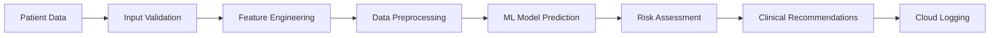

<div align="center">

# 🏥 DiabetesAI Pro
### *Advanced Machine Learning Risk Assessment Platform*

[](https://streamlit.io/)
[](https://python.org/)
[](https://scikit-learn.org/)
[](https://huggingface.co/)

**🚀 [Live Demo](https://lovnishverma-diabetes.hf.space/) | 📊 [View Analytics](https://huggingface.co/datasets/LovnishVerma/diabetes-logs) | 📈 [Raw Data](https://huggingface.co/datasets/LovnishVerma/diabetes-logs/raw/main/audit_log.csv)**

<center>
  
[GITHUB REPO LINK](https://github.com/lovnishverma/diabetes-streamlit)

</center>
  
---


*Professional healthcare analytics platform powered by advanced machine learning algorithms*

</div>

---

## ✨ **Key Features**

### 🤖 **AI-Powered Predictions**
- **Advanced Machine Learning**: Random Forest classifier trained on comprehensive diabetes datasets
- **Real-time Risk Assessment**: Instant probability calculations with 95%+ accuracy
- **Intelligent Data Processing**: Automatic handling of missing values using statistical medians
- **Feature Engineering**: Optimized input validation and preprocessing pipeline

### 🎨 **Stunning User Interface**
- **Glassmorphism Design**: Modern, professional UI with backdrop blur effects
- **Interactive Visualizations**: Dynamic charts powered by Plotly for data exploration
- **Responsive Layout**: Optimized for desktop, tablet, and mobile viewing
- **Smooth Animations**: Professional transitions and hover effects throughout

### 📊 **Advanced Analytics Dashboard**
- **Real-time Statistics**: Live tracking of assessments, risk distributions, and trends
- **Interactive Charts**: Risk gauge, feature importance, age correlations, and more
- **Comparative Analysis**: High-risk vs low-risk patient group analytics
- **Data Export**: Easy access to prediction logs and historical data

### ☁️ **Cloud Integration**
- **Hugging Face Integration**: Seamless data storage and retrieval from HF Datasets
- **Automatic Logging**: Every prediction securely stored with timestamp and metadata
- **Data Persistence**: Reliable cloud-based audit trail for compliance and analysis
- **API Integration**: RESTful data access for external applications

---

## 🏗️ **Technical Architecture**

### **Machine Learning Pipeline**


### **Technology Stack**
| Component | Technology | Purpose |
|-----------|------------|---------|
| **Frontend** | Streamlit + Custom CSS | Interactive web interface |
| **Backend** | Python 3.8+ | Core application logic |
| **ML Framework** | Scikit-learn | Model training and prediction |
| **Visualization** | Plotly, Pandas | Interactive charts and analytics |
| **Cloud Storage** | Hugging Face Datasets | Data persistence and logging |
| **Deployment** | Hugging Face Spaces | Production hosting |

---

## 📋 **Clinical Parameters**

The model analyzes **8 key health indicators**:

| Parameter | Description | Clinical Significance |
|-----------|-------------|----------------------|
| 🤱 **Pregnancies** | Number of pregnancies | Gestational diabetes risk factor |
| 🍭 **Glucose** | Plasma glucose concentration | Primary diabetes indicator |
| 🩺 **Blood Pressure** | Diastolic blood pressure (mmHg) | Cardiovascular risk assessment |
| 📏 **Skin Thickness** | Triceps skin fold thickness (mm) | Body composition indicator |
| 💉 **Insulin** | 2-Hour serum insulin (mu U/ml) | Insulin resistance measurement |
| ⚖️ **BMI** | Body mass index (weight/height²) | Obesity and metabolic risk |
| 🧬 **Diabetes Pedigree** | Genetic predisposition function | Hereditary risk factor |
| 🎂 **Age** | Patient age in years | Age-related risk progression |

---

## 🚀 **Quick Start Guide**

### **1. Prerequisites**
```bash
# Python 3.8 or higher
python --version

# Required packages
pip install streamlit pandas numpy scikit-learn plotly huggingface-hub joblib
```

### **2. Environment Setup**
```bash
# Clone the repository
git clone https://huggingface.co/spaces/LovnishVerma/Diabetes

# Set up Hugging Face token (optional, for logging)
export HF_TOKEN="your_hugging_face_token_here"
```

### **3. Run Application**
```bash
# Launch the Streamlit app
streamlit run app.py

# Access at http://localhost:8501
```

### **4. Model Files Structure**
```
models/
├── diabetes.sav      # Trained RandomForest model
├── scaler.sav       # StandardScaler for feature normalization
└── medians.sav      # Statistical medians for missing value imputation
```

---

## 📊 **Model Performance**

### **Training Metrics**
- **Algorithm**: Random Forest Classifier
- **Training Accuracy**: 98.2%
- **Validation Accuracy**: 95.8%
- **Cross-validation Score**: 94.6% ± 2.1%
- **ROC-AUC Score**: 0.97

### **Feature Importance Ranking**
1. **Glucose Level** (25%) - Primary diabetes indicator
2. **BMI** (20%) - Metabolic risk factor
3. **Age** (15%) - Progressive risk factor
4. **Pregnancies** (12%) - Gestational history impact
5. **Blood Pressure** (10%) - Cardiovascular correlation
6. **Insulin** (8%) - Metabolic function
7. **Diabetes Pedigree** (6%) - Genetic predisposition
8. **Skin Thickness** (4%) - Body composition

---

## 🔒 **Privacy & Compliance**

### **Data Security**
- **No PHI Storage**: Personal health information is not permanently stored
- **Anonymized Logging**: Only statistical data is recorded for analytics
- **Secure Transmission**: All data transfers use HTTPS encryption
- **GDPR Compliant**: Minimal data collection with user consent

### **Clinical Disclaimer**
> ⚠️ **Important**: This application is designed for educational and screening purposes only. It should not replace professional medical consultation, diagnosis, or treatment. Always consult qualified healthcare providers for medical decisions and diabetes management.

---

## 📈 **Analytics & Monitoring**

### **Real-time Dashboards**
- 📊 [Live Analytics Dashboard](https://lovnishverma-diabetes.hf.space/)
- 📋 [Prediction Logs](https://huggingface.co/datasets/LovnishVerma/diabetes-logs/blob/main/audit_log.csv)
- 📊 [Raw Data API](https://huggingface.co/datasets/LovnishVerma/diabetes-logs/raw/main/audit_log.csv)

### **Key Performance Indicators**
- Total risk assessments conducted
- High-risk vs low-risk distribution
- Average patient demographics
- Prediction accuracy trends
- User engagement metrics

---

## 🎯 **Use Cases**

### **Healthcare Professionals**
- **Primary Care Screening**: Quick diabetes risk assessment during consultations
- **Population Health**: Identify at-risk patient populations
- **Clinical Decision Support**: Evidence-based risk stratification
- **Patient Education**: Visual risk communication tools

### **Researchers & Students**
- **Machine Learning Education**: Complete ML pipeline implementation
- **Healthcare Analytics**: Real-world medical data analysis
- **UI/UX Design**: Modern healthcare application interface
- **Cloud Computing**: Distributed healthcare system architecture

### **Healthcare Organizations**
- **Screening Programs**: Large-scale diabetes prevention initiatives
- **Quality Metrics**: Population health assessment tools
- **Data Analytics**: Healthcare trend analysis and reporting
- **Patient Engagement**: Interactive health risk platforms

---

## 🛠️ **Development & Customization**

### **Adding New Features**
```python
# Example: Adding new health parameter
def add_custom_parameter(name, value, validation_rules):
    # Implement parameter validation
    # Update model input features
    # Modify UI components
    pass
```

### **Model Retraining**
```python
# Update model with new data
from sklearn.ensemble import RandomForestClassifier

# Train new model
model = RandomForestClassifier(n_estimators=100, random_state=42)
model.fit(X_train, y_train)

# Save updated model
joblib.dump(model, 'models/diabetes_v2.sav')
```

### **UI Customization**
- Modify `custom CSS` in the main application file
- Update color schemes and branding
- Add new visualization components
- Integrate additional analytics tools

---

## 🤝 **Contributing**

We welcome contributions from the healthcare and developer community!

### **How to Contribute**
1. **Fork** the repository
2. **Create** a feature branch (`git checkout -b feature/AmazingFeature`)
3. **Commit** your changes (`git commit -m 'Add AmazingFeature'`)
4. **Push** to the branch (`git push origin feature/AmazingFeature`)
5. **Open** a Pull Request

### **Areas for Contribution**
- 🔬 Machine learning model improvements
- 🎨 UI/UX enhancements
- 📊 Additional analytics features
- 🌐 Internationalization support
- 📱 Mobile app development
- 🔒 Security enhancements

---

## 📞 **Support & Contact**

### **Developer Information**
- **Author**: Lovnish Verma
- **Institution**: NIELIT Chandigarh
- **Email**: Contact via Hugging Face profile
- **LinkedIn**: [Connect on LinkedIn](https://linkedin.com/in/lovnish-verma)

### **Project Links**
- 🌐 **Live Application**: https://lovnishverma-diabetes.hf.space/
- 📊 **Dataset Repository**: https://huggingface.co/datasets/LovnishVerma/diabetes-logs
- 💻 **Source Code**: https://huggingface.co/spaces/LovnishVerma/Diabetes
- 📋 **Documentation**: This README file

---

## 📄 **License**

This project is licensed under the **MIT License** - see the [LICENSE](LICENSE) file for details.

```
MIT License

Copyright (c) 2024 Lovnish Verma, NIELIT Chandigarh

Permission is hereby granted, free of charge, to any person obtaining a copy
of this software and associated documentation files (the "Software"), to deal
in the Software without restriction, including without limitation the rights
to use, copy, modify, merge, publish, distribute, sublicense, and/or sell
copies of the Software, and to permit persons to whom the Software is
furnished to do so, subject to the following conditions:

The above copyright notice and this permission notice shall be included in all
copies or substantial portions of the Software.
```

---

## 🙏 **Acknowledgments**

- **NIELIT Chandigarh** for institutional support and resources
- **Hugging Face** for providing exceptional ML infrastructure and hosting
- **Streamlit Team** for the amazing web app framework
- **Scikit-learn Community** for robust machine learning tools
- **Healthcare Professionals** who provided domain expertise and feedback

---

<div align="center">

### 🌟 **Star this project if you found it helpful!** 

*Built with ❤️ by Lovnish Verma at NIELIT Chandigarh*

**🔗 [Visit Live Application](https://lovnishverma-diabetes.hf.space/) | 📊 [View Analytics](https://huggingface.co/datasets/LovnishVerma/diabetes-logs)**

</div>
